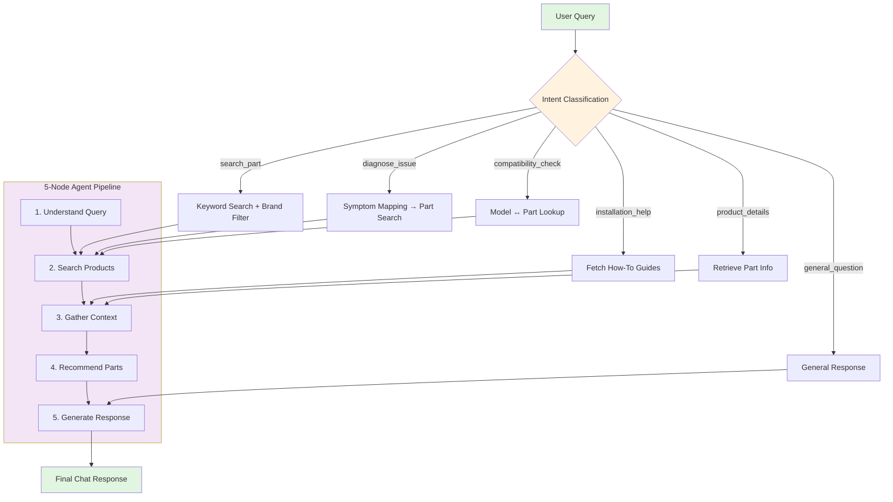

# 🤖 PartSelect AI Chat Agent

An intelligent conversational agent for appliance parts e-commerce — built with **LangGraph, FastAPI, PostgreSQL, Redis, and React**.

The system supports:
- 🔍 Part search  
- 🛠️ Issue diagnosis  
- 🔄 Compatibility checks  
- 📹 Installation guidance  
- 💬 Multi-turn AI conversations  

---

## 🌟 Overview

This platform uses an **intent-driven architecture** powered by a **5-node LangGraph agent**:

- 🧠 **LLM-based intent classification**  
- 💾 **Redis-backed context persistence**  
- 🔍 **Hybrid search** (Postgres full-text + ChromaDB semantic search)  
- 🔧 **Diagnostic reasoning**  
- 🟢 **Real-time part recommendations**  
- 📘 **Installation instructions & videos**  

---

## 🏗️ Architecture Flowchart



Quick Start
Prerequisites

Python 3.9+

Node.js 16+

Docker + Docker Compose

1️⃣ Start Infrastructure
# Start PostgreSQL, Redis, ChromaDB
docker-compose up -d

# Verify containers
docker-compose ps

2️⃣ Backend Setup
cd partselect-backend

## Install dependencies
pip install -r requirements.txt

## Create environment file
cp .env.example .env
Add your DEEPSEEK_API_KEY

Load Data
python scripts/load_data.py
python scripts/load_semantic_data.py

Start API Server
python -m app.main
 → http://localhost:8000

3️⃣ Frontend Setup
cd partselect-frontend

npm install
npm start
→ http://localhost:3000
5-Node Agent Pipeline
python1. Understand Query    # LLM intent classification + entity extraction
2. Search Products     # Multi-strategy search (keyword/symptom/semantic)
3. Gather Context      # ChromaDB semantic search + guides
4. Recommend Parts     # LLM ranking by relevance
5. Generate Response   # Natural language generation
```

## Intent-Driven Routing
6 distinct intents route to optimized workflows:

search_part - Browse and find parts
diagnose_issue - Symptom → solution mapping
compatibility_check - Part ↔ model verification
installation_help - How-to guides with videos
product_details - Detailed part information
general_question - Conversational fallback
### 💬 Conversation State Management
- Redis-backed state (24h TTL)
- Context preservation across messages
- Smart entity merging (only updates new values)

---

## 📊 Tech Stack

| Layer | Technology | Purpose |
|-------|-----------|---------|
| **Frontend** | React | Chat interface |
| **Backend** | FastAPI | REST API |
| **Agent** | LangGraph | Workflow orchestration |
| **LLM** | DeepSeek | Intent & reasoning |
| **Database** | PostgreSQL | Product catalog (311 items) |
| **Vector Store** | ChromaDB | Semantic search (720 docs) |
| **Cache** | Redis | Conversation state |
| **Deployment** | Docker Compose | Container orchestration |

---

## 🗂️ Project Structure
```
partselect-backend/
├── app/
│   ├── agent/          # LangGraph agent logic
│   │   ├── graph.py    # Agent workflow
│   │   ├── nodes.py    # 5 processing nodes
│   │   ├── state.py    # State schema
│   │   ├── intent.py   # Intent classifier
│   │   └── tools.py    # Search tools
│   ├── api/            # FastAPI endpoints
│   │   ├── chat.py     # POST /chat
│   │   └── products.py # GET /products
│   ├── core/           # Core services
│   │   ├── database.py # PostgreSQL
│   │   ├── llm.py      # DeepSeek client
│   │   └── config.py   # Configuration
│   └── main.py         # FastAPI app
├── data/               # Scraped & processed data
├── scripts/            # Data loading scripts
└── docker-compose.yml  # Infrastructure

partselect-frontend/
├── src/
│   ├── components/
│   │   └── ChatWindow.js  # Main chat UI
│   └── api/
│       └── api.js         # API client
