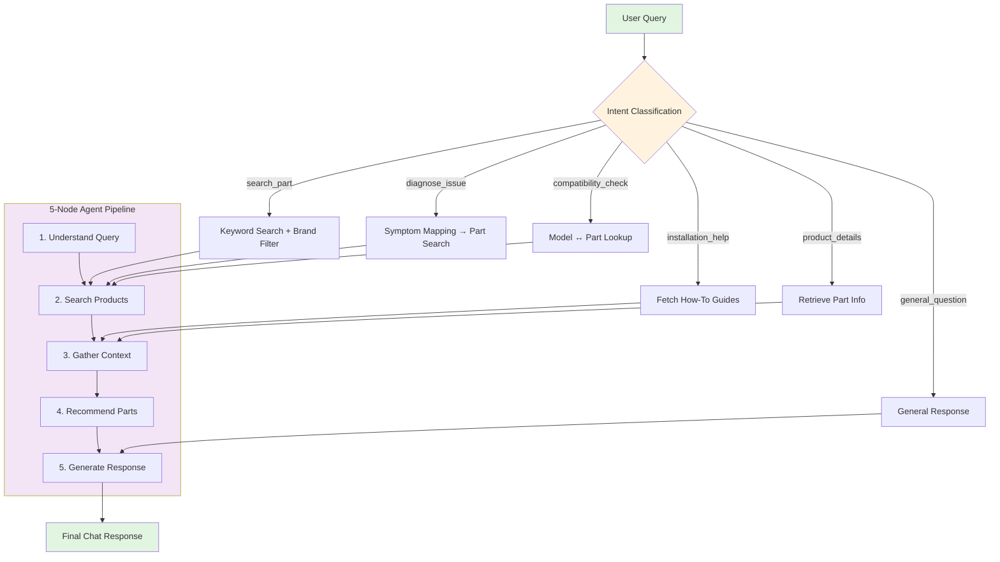

#  PartSelect AI Chat Agent

An intelligent conversational agent for appliance parts e-commerce — built with **LangGraph, FastAPI, PostgreSQL, Redis, and React**.

The system supports:
-  Part search  
-  Issue diagnosis  
-  Compatibility checks  
-  Installation guidance  
-  Multi-turn AI conversations  

---

##  Overview

This platform uses an **intent-driven architecture** powered by a **5-node LangGraph agent**:

-  **LLM-based intent classification**  
-  **Redis-backed context persistence**  
-  **Hybrid search** (Postgres full-text + ChromaDB semantic search)  
-  **Diagnostic reasoning**  
-  **Real-time part recommendations**  
-  **Installation instructions & videos**  

---

## Angentic Architecture Flowchart



---

# Quick Start

### **Prerequisites**
- Python 3.9+
- Node.js 16+
- Docker & Docker Compose

---

## **1️⃣ Start Infrastructure**

```bash
# Start PostgreSQL, Redis, ChromaDB
docker-compose up -d

# Verify containers
docker-compose ps
```

---

## **2️⃣ Backend Setup**

```bash
cd partselect-backend
```

### Install dependencies:

```bash
pip install -r requirements.txt
```

### Create `.env`:

```bash
cp .env.example .env
# Add your DEEPSEEK_API_KEY inside the new .env
```

### Load product data:

```bash
python scripts/load_data.py
python scripts/load_semantic_data.py
```

### Start the API server:

```bash
python -m app.main
# → http://localhost:8000
```

---

## **3️⃣ Frontend Setup**

```bash
cd partselect-frontend

npm install
npm start
# → http://localhost:3000
```

---

##  5-Node Agent Pipeline

```
1. Understand Query    # LLM intent classification + entity extraction
2. Search Products     # Keyword, symptom, brand, semantic search
3. Gather Context      # ChromaDB semantic docs + guides
4. Recommend Parts     # LLM relevance ranking
5. Generate Response   # Natural language answer
```

---

## Intent-Driven Routing

6 distinct intents with custom workflows:

- **search_part** — Browse & find parts  
- **diagnose_issue** — Map symptoms → likely failing parts  
- **compatibility_check** — Verify part ↔ model compatibility  
- **installation_help** — Provide instructions & videos  
- **product_details** — Fetch detailed information  
- **general_question** — Fallback conversation  

---

##  Conversation State Management

- Redis-based state (24h TTL)  
- Maintains multi-turn context  
- Smart entity merging  

---

##  Tech Stack

| Layer | Technology | Purpose |
|-------|-----------|---------|
| **Frontend** | React | Chat UI |
| **Backend** | FastAPI | API services |
| **Agent** | LangGraph | Orchestration |
| **LLM** | DeepSeek | Reasoning + intent |
| **Database** | PostgreSQL | Product catalog |
| **Vector Store** | ChromaDB | Semantic search |
| **Cache** | Redis | Conversation state |
| **Deploy** | Docker Compose | Infra orchestration |

---

##  Project Structure

```
partselect-backend/
├── app/
│   ├── agent/
│   │   ├── graph.py
│   │   ├── nodes.py
│   │   ├── state.py
│   │   ├── intent.py
│   │   └── tools.py
│   ├── api/
│   │   ├── chat.py
│   │   └── products.py
│   ├── core/
│   │   ├── database.py
│   │   ├── llm.py
│   │   └── config.py
│   └── main.py
├── data/
├── scripts/
└── docker-compose.yml

partselect-frontend/
├── src/
│   ├── components/
│   │   └── ChatWindow.js
│   └── api/
│       └── api.js
```
