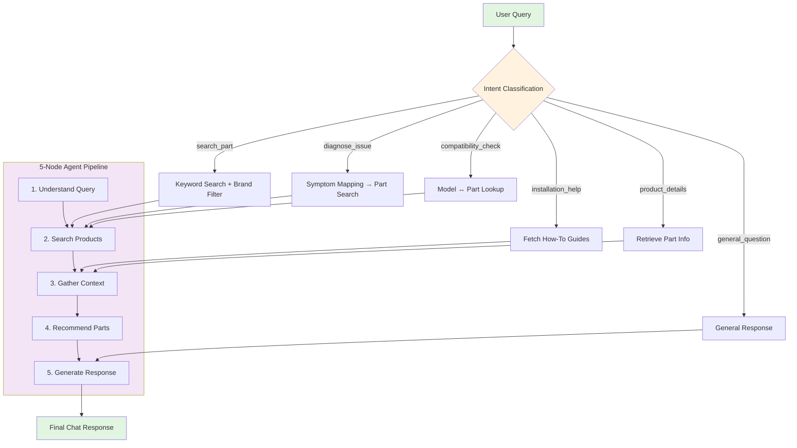

# 🤖 PartSelect AI Chat Agent

An intelligent conversational agent for appliance parts e-commerce — built with **LangGraph, FastAPI, PostgreSQL, Redis, and React**.

The system supports:
- 🔍 Part search  
- 🛠️ Issue diagnosis  
- 🔄 Compatibility checks  
- 📹 Installation guidance  
- 💬 Multi-turn AI conversations  

---

## 🌟 Overview

This platform uses an **intent-driven architecture** powered by a **5-node LangGraph agent**:

- 🧠 **LLM-based intent classification**  
- 💾 **Redis-backed context persistence**  
- 🔍 **Hybrid search** (Postgres full-text + ChromaDB semantic search)  
- 🔧 **Diagnostic reasoning**  
- 🟢 **Real-time part recommendations**  
- 📘 **Installation instructions & videos**  

---

## 🏗️ Architecture Flowchart

Quick Start
Prerequisites

Python 3.9+

Node.js 16+

Docker + Docker Compose

1️⃣ Start Infrastructure
# Start PostgreSQL, Redis, ChromaDB
docker-compose up -d

# Verify containers
docker-compose ps

2️⃣ Backend Setup
cd partselect-backend

# Install dependencies
pip install -r requirements.txt

# Create environment file
cp .env.example .env
# Add your DEEPSEEK_API_KEY

Load Data
python scripts/load_data.py
python scripts/load_semantic_data.py

Start API Server
python -m app.main
# → http://localhost:8000

3️⃣ Frontend Setup
cd partselect-frontend

npm install
npm start
# → http://localhost:3000
